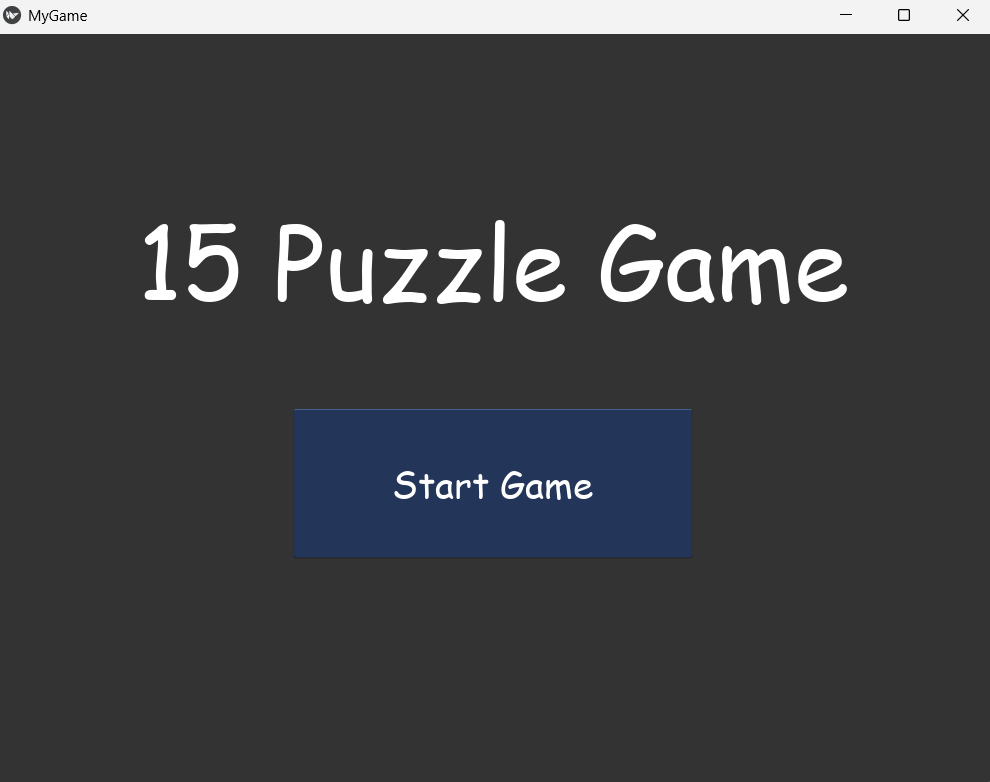
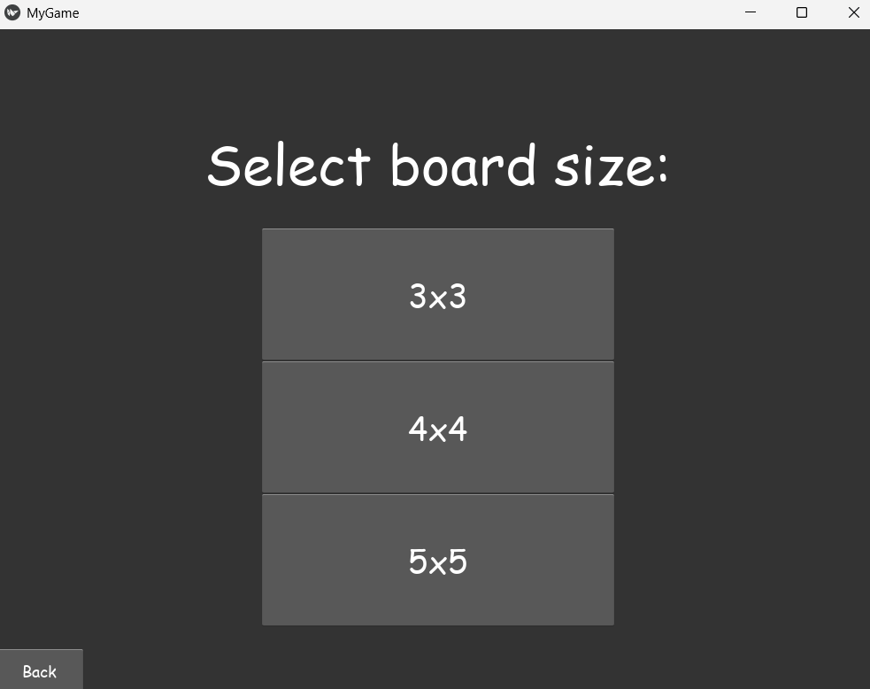
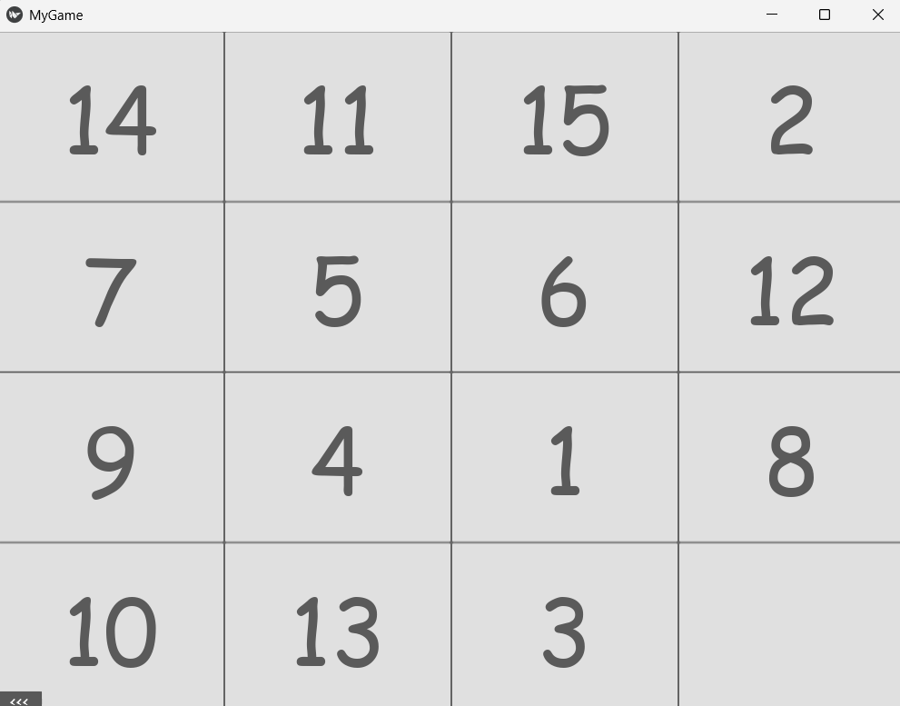
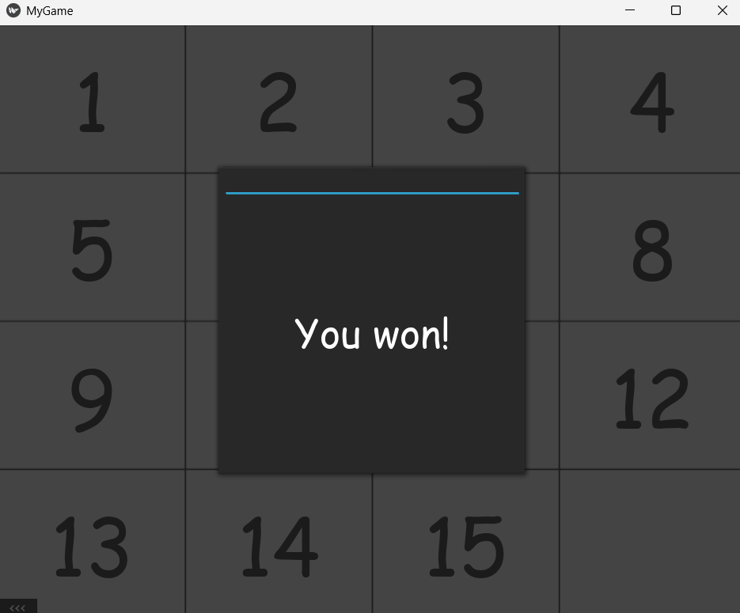

# 15 Puzzle Game (Kivy App)
A sliding puzzle game built with **Python** and [**Kivy**](https://kivy.org/). Choose from 3x3, 4x4, or 5x5 board sizes and challenge yourself to solve the puzzle by arranging the tiles in order. Includes sound, visual effects, and victory detection.

---

## Demo






> *This is a classic "n-puzzle" where only one space is empty and you must slide the tiles to their correct positions.*

---

## Features
- Solvable tile generation
- Background music (looped)
- Clean UI with custom fonts and colors
- Victory popup on solving
- In-game Back button
- Choose board size: 3x3, 4x4, or 5x5

## Installation

```bash
git clone https://github.com/Jirasak-Guy/Kivy_NumberSlidePuzzleGame.git
cd Kivy_NumberSlidePuzzleGame
python -m pip install "kivy[base]"
python 15_puzzle_game.py
```